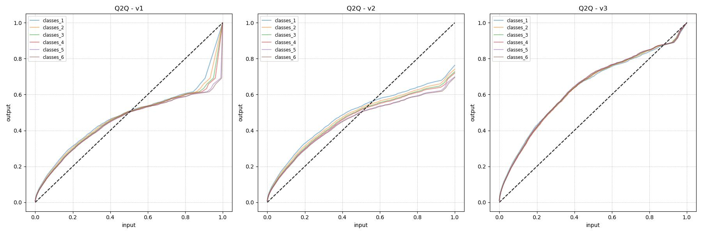
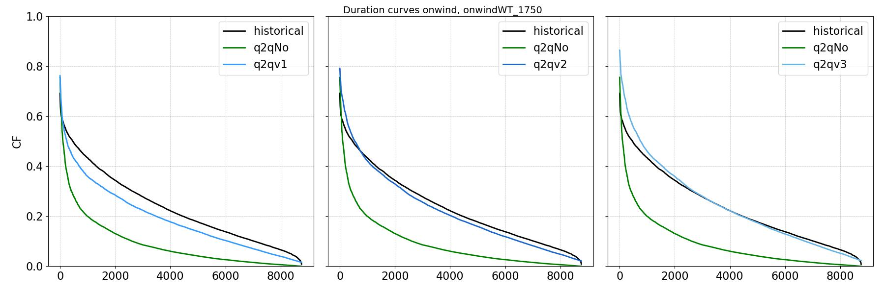
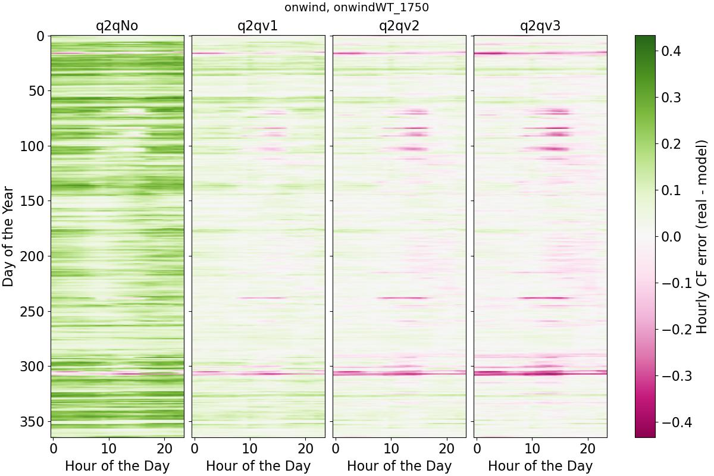
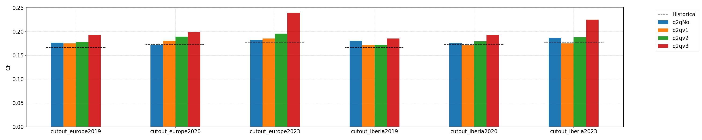
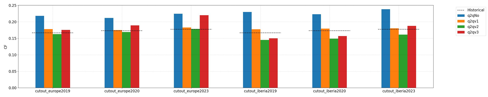

# Q2Q Repository

## Overview

This repository provides data, scripts and ready-to-use **quantile-to-quantile (Q2Q) transformations** to improve hourly generation time series for **onshore wind and solar PV** in **PyPSA-Spain**.

## Background and Motivation

Estimating hourly generation time series for renewable technologies is challenging. A common *physical approach* combines weather model outputs (e.g. wind speed or solar radiation) with simplified conversion models for wind turbines or solar PV panels. Errors may arise at multiple stages of this process, including biases in weather data, spatial and temporal discretisation, and simplified conversion assumptions.

In [PyPSA-Spain](https://github.com/cristobal-GC/pypsa-spain), a methodology to reduce these errors was proposed and implemented (see details in the [seminal paper](https://doi.org/10.1016/j.esr.2025.101764)). The method, based on the **quantile-to-quantile (Q2Q) transformation**, statistically maps modelled hourly capacity factors to historical ones.

The main **advantage** of the Q2Q transformation is that it corrects all systematic errors jointly, regardless of their source.
Its main **limitations** are that it does not provide information on the origin of those errors, and that historical data is required.

## What This Repository Provides

This repository allows you to:

* Access a collection of **precomputed Q2Q transformations** ready to be used in PyPSA-Spain.
* Analyse the performance of Q2Q transformations under different modelling assumptions.
* Reproduce all analyses and figures presented.

All data and results are **specific to Spain**. The same methodology can be applied to other countries if historical renewable generation time series are available.

## Repository Structure

* `data/`
  Historical and modelled hourly generation time series at country level (except Canary Islands) for onshore wind and solar PV, together with historical installed capacities.
  Historical data are sourced from [esios](https://api.esios.ree.es/). Modelled data are generated with PyPSA-Spain under different configurations (see below).

* `envs/`
  Python environment required to run the repository scripts.

* `figs/`
  Figures of Q2Q transformations and performance evaluation results.

* `funs/`
  Auxiliary Python functions used by the scripts.

* `notebooks/`
  Jupyter notebooks providing tutorials and illustrative examples.

* `pypsa-spain/`
  Configuration files used to generate the modelled time series.

* `q2q_repository/`
  Precomputed Q2Q transformations, ready to be used in PyPSA-Spain (subject to consistency of modelling assumptions).

* `scripts/`
  Python scripts to reproduce all data processing, transformations and figures.

## Analyses and Scenarios

To assess the robustness of the Q2Q transformation, one **Reference analysis** and **four sensitivity analyses** were performed. Each analysis includes several scenarios in which only one parameter is modified relative to the reference.

The analyses are:

1. **cutout**:
   Different weather cutouts covering 2019, 2020 and 2023, and two data sources (*europe*: ERA5+SARAH, *iberia*: ERA5).

2. **cluster**:
   Spatial aggregation using administrative units (NUTS2, NUTS3) and busmaps with 15, 50 and 100 nodes.

3. **classes**:
   Number of renewable classes per carrier and bus, from 1 to 6.

4. **onwindWT**:
   Six onshore wind turbine models with rated power between 1.5 and 4 MW.

Each analysis is performed twice, assuming either `solar` or `solar-hsat` technology for solar PV. Historical data do not distinguish between these technologies, so only one is assumed in each case.

## Methodological Workflow

For each sensitivity analysis, the following steps are applied:

1. PyPSA-Spain is run for all scenarios **without Q2Q correction**, using historical NUTS-2 renewable capacities.    
   Configuration files are located in `pypsa-spain/config/analyses/{analysis}/`.

2. Modelled generation time series are extracted and stored in `data/modelled_data/{analysis}/` using `generate_modelled_data.py`.

3. Q2Q transformations are computed by comparing modelled and historical time series (`data/historical_data/`) using `generate_Q2Q_transformations.py`.
   Results are stored in `q2q_repository/{analysis}/`.

4. Q2Q transformations are plotted using `plot_Q2Q_transforms.py` and `plot_Q2Q_transforms_ALL.py`, and saved in `figs/q2q_transforms/{analysis}/`. As an example, the figure below shows the different Q2Q transformations obtained for carrier onshore wind, three normalisation schemes and different number of carrier classes.
  

    
  

5. PyPSA-Spain is run again for all scenarios, **including Q2Q correction**.

6. Corrected generation time series are extracted using the same script as in step 2.

7. Performance metrics and evaluation figures are generated with `plot_evaluation_CF.py` and stored in `figs/evaluation/`.

## Key Results and Recommendations

* **Onshore wind**:
  Q2Q correction is **essential** to address the systematic underestimation of capacity factors when using ERA5 data.
  The recommended normalisation scheme is `v2`.

  The figure below compares onwind annual CFs for different cutouts.
  

    
  

  The figure below compares the duration curves for the wind turbine model with a rated capacity of 1.75 MW.
  

    
  

  The figure below compares the hCF errors for the wind turbine model with a rated capacity of 1.75 MW. Errors on specific challenging days are not fully corrected by the Q2Q transformation.
  

    
  

* **Solar PV**:
  Assuming `solar`, Q2Q only provides **minor improvements**, as capacity factors are already estimated accurately.
  The recommended normalisation scheme is `v1`, although no Q2Q or scheme `v2` would also provide similar performance. Avoid scheme `v3`.

  Assuming `solar-hsat`, large errors are obtained if no Q2Q transformation is applied. The recommended schemes are `v1` and `v2`.

  The figure below compares solar annual CFs for different cutouts. Top: `solar`, bottom: `solar-hsat`.
  

    
  

  

    
  

* **Q2Q selection**. When applying a Q2Q transformation from this repository to new PyPSA-Spain scenarios, modelling assumptions should match as closely as possible those used to generate the transformation.
Some parameters (e.g. clustering, especially for solar PV) have limited impact, while others (weather year, number of wind classes, turbine model) are critical.

* Further insights can be drawn from the set of results and figures contained in this repository.

> Note: The recommended normalisation schemes differ from those in the [seminal paper](https://doi.org/10.1016/j.esr.2025.101764) due to methodological changes introduced in PyPSA-Eur between versions `v0.0.0` and `v2025.04.0` of PyPSA-Spain.

## Further Information and Contributions

If you find errors, have suggestions, or want to contribute, please use the [Issues](https://github.com/cristobal-GC/Q2Q_repository/issues) section or open a [Pull Request](https://github.com/cristobal-GC/Q2Q_repository/pulls).

If you find errors, have suggestions for improvement, or would like to contribute, please open an [issues](https://github.com/cristobal-GC/Q2Q_repository/issues) or submit a [Pull Request](https://github.com/cristobal-GC/Q2Q_repository/pulls).